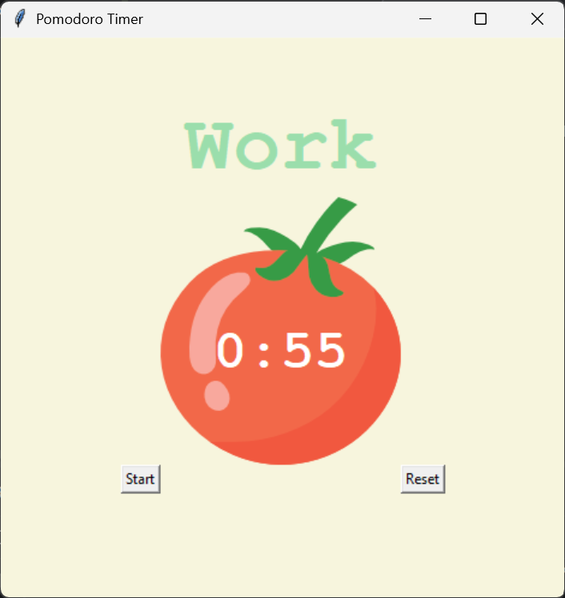

# Pomodoro Timer 🍅⏳


A clean and simple **Pomodoro Timer** built with Python and Tkinter to help improve focus, manage study/work sessions, and stay productive with short breaks.

---

## ✨ Overview

This project follows the Pomodoro technique:

- Work for 25 minutes.
- Take a short 5-minute break.
- After 4 work sessions, take a longer 20-minute break.
- Repeat the cycle to maintain focus and avoid burnout.

---

## 🚀 Features

- Start and reset timer controls.
- Automatic session switching.
- Work, short break, and long break modes.
- Visual progress with check marks.
- Minimal and beginner-friendly GUI.
- Built using Python Tkinter.

---

## 🖼️ Screenshot

> 

```md

```

---

## 🛠️ Tech Stack

- Python
- Tkinter
- Math module

---

## 📂 Project Structure

```bash
pomodoro-timer/
├── main.py
├── tomato.png
└── README.md
```

---

## ▶️ How to Run

### 1. Clone the repository

```bash
git clone [https://github.com/your-username/pomodoro-timer.git](https://github.com/your-username/pomodoro-timer.git)
```

### 2. Go to the project folder

```bash
cd pomodoro-timer
```

### 3. Run the application

```bash
python main.py
```

---

## 🧠 What I Learned

- How to build a GUI with Tkinter.
- How to use `after()` for countdown timers.
- How to manage work/break cycles.
- How to organize a Python project.
- How to build and improve a real portfolio project.

---

## 🔮 Future Improvements

- Add pause and resume.
- Add sound notifications.
- Let users set custom session lengths.
- Add a dark mode theme.
- Track completed sessions per day.

---

## 📜 License

This project is for learning and personal use.

---

## 🙌 Credits

Built as a productivity project using Python and Tkinter.
